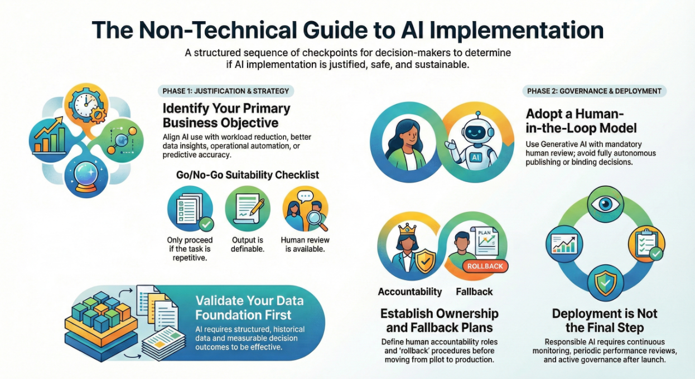

# 🧭 AI Implementation Decision Framework

## A Governance-Oriented Decision Model for Non-Technical Leaders

A structured decision support framework helping leaders determine **whether AI should be implemented — and under what conditions.**

---

# 🖼 Executive Visual Overview

Below is a high-level visualization of the framework’s structured decision checkpoints.

---

# 🎯 What It Solves

Organizations often adopt AI without validating:

- Data readiness  
- Governance structure  
- Operational risk  
- Accountability ownership  

This framework introduces structured validation gates **before AI adoption.**

AI implementation is treated as a **management decision — not a technology experiment.**

---

# 🧩 What It Includes

- Conditional decision pathways  
- Objective-based validation checkpoints  
- Risk & governance review stage  
- Pilot-before-scale safeguards  
- Responsible deployment conditions  

---

# 🏗 Framework Structure

The model follows a structured pathway:

1. Define Primary Business Objective  
2. Validate AI Justification Conditions  
3. Apply Implementation Safeguards  
4. Conduct Risk & Governance Check  
5. Pilot Before Scaling  
6. Confirm Responsible Deployment Conditions  

If any condition fails, **process optimization precedes technology adoption.**

---

# 👥 Designed For

- Non-technical leaders  
- Compliance & governance professionals  
- Regulated industries  
- AI governance practitioners  

---

# 📂 Access the Framework

📄 **Full Report (PDF)**  
See: `Raport.pdf`

🌐 **Interactive Version**  
[View Interactive Framework](PASTE_YOUR_GENIALLY_LINK_HERE)

---

# 📌 Version

**v1.0 – 2026**

Responsible AI is not a one-time decision.  
It is an ongoing governance responsibility.

---

© 2026 Katarzyn
